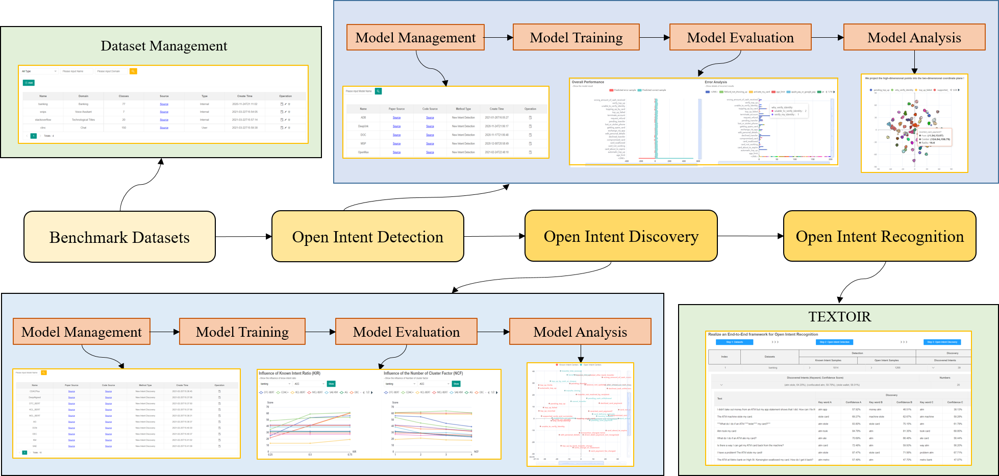
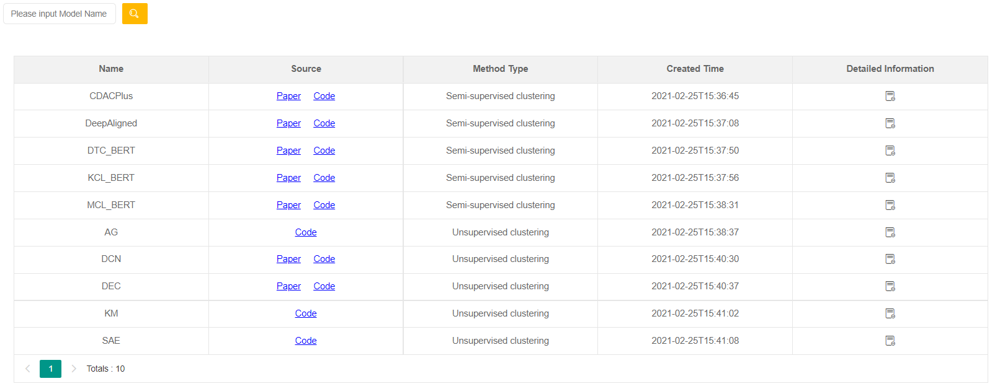
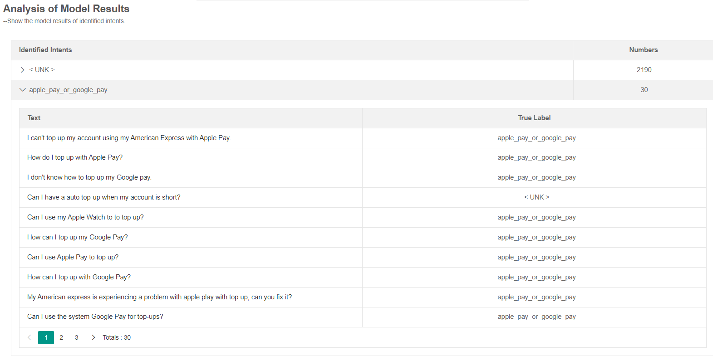
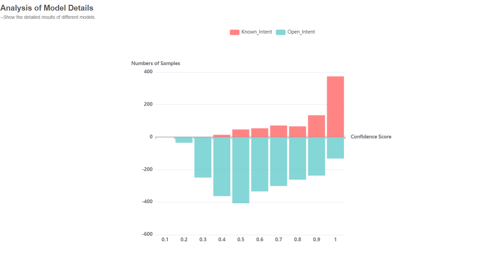
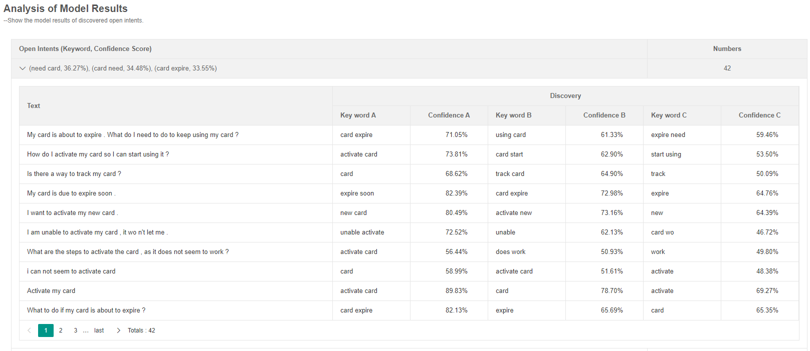
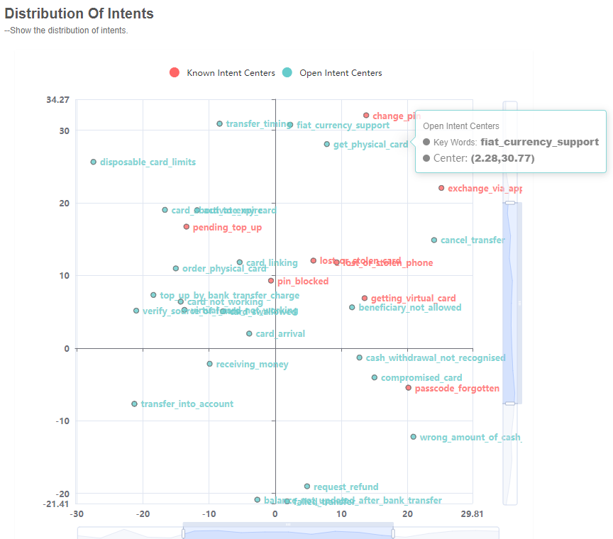
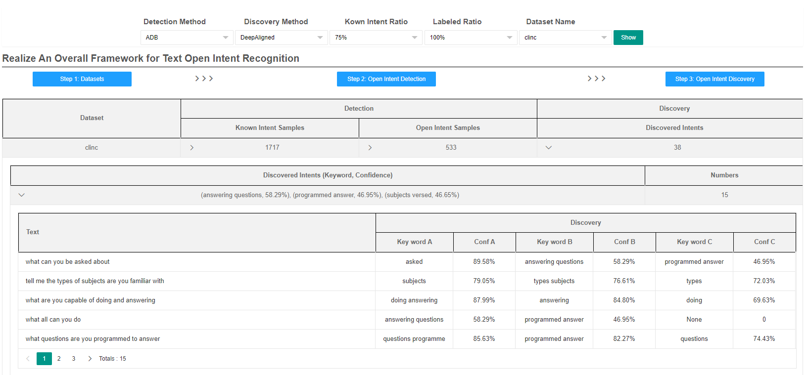

# TEXTOIR: An Integrated and Visualized Platform for Text Open Intent Recognition

## Introduction

**TEXOIR** is the first integrated and visualized platform for text Open Intent Recognition. **This repo is based on the [TEXTOIR toolkit](https://github.com/thuiar/TEXTOIR)**. It contains a pipeline framework to perform [open intent detection](./open_intent_detection) and [open_intent_discovery](./open_intent_discovery) simultaneously. It also consists of a [visualization system](./frontend) to demonstrate the whole process of the two sub-modules and the pipeline framework. More information can be seen on our [ACL 2021 demo paper](https://aclanthology.org/2021.acl-demo.20.pdf). 

If you are interested in this work, and want to use the codes in this repo, please **star** and **fork** this repo, and cite the following paper:
```
@inproceedings{zhang-etal-2021-textoir,
    title = "{TEXTOIR}: An Integrated and Visualized Platform for Text Open Intent Recognition",
    author = "Zhang, Hanlei  and
      Li, Xiaoteng  and
      Xu, Hua  and
      Zhang, Panpan  and
      Zhao, Kang  and
      Gao, Kai",
    booktitle = "Proceedings of the 59th Annual Meeting of the Association for Computational Linguistics and the 11th International Joint Conference on Natural Language Processing: System Demonstrations",
    year = "2021",
    pages = "167--174",
}
```

## Overall Framework

We propose a pipeline scheme to finish the whole process of both identifying known intents and discovering open intents. First, we prepare the intent data for the two modules (open intent detection and open intent discovery) with the assigned labeled ratio and known intent ratio. Then, we set the hyper-parameters and prepare the backbone for feature extraction. 

After data and model preparation, we use the labeled known intent data to train the selected open intent detection method. The well-trained detection model is used to predict the known intents and detect the open intent. Then, the predicted and labeled known intents are used to train the open intent discovery model. The well-trained discovery model further cluster the open intent into fine-grained intent-wise classes.

Finally, we combine the predicted results of the two modules, containing the identified known intents and discovered open-intent clusters. We extract top-3 key-words as the reference intents of each open-intent cluster.


## Visualized Platform

The visualized platform contains four parts, data management, open intent detection, open intent discovery and open intent recognition. The 

The TEXTOIR visualized platform:  



### Data Management

We integate four benchmark intent datasets as follows:
* [BANKING](https://arxiv.org/pdf/2003.04807.pdf)
* [OOS / CLINC150 (without OOD samples)](https://arxiv.org/pdf/1909.02027.pdf) 
* [StackOverflow](https://aclanthology.org/W15-1509.pdf)
* [SNIPS](https://arxiv.org/pdf/1805.10190.pdf)

The visualized interface is convenient to add new datasets, edit the related information, delete or search current datasets. 


### Model Management

#### Open Intent Detection

This module integrates five advanced open intent detection methods:

* [Deep Open Intent Classification with Adaptive Decision Boundary](https://ojs.aaai.org/index.php/AAAI/article/view/17690) (ADB, AAAI 2021)
* [Deep Unknown Intent Detection with Margin Loss](https://aclanthology.org/P19-1548.pdf) (DeepUnk, ACL 2019)
* [DOC: Deep Open Classification of Text Documents](https://aclanthology.org/D17-1314.pdf) (DOC, EMNLP 2017)
* [A Baseline For Detecting Misclassified and Out-of-distribution Examples in Neural Networks](https://arxiv.org/pdf/1610.02136.pdf) (MSP, ICLR 2017) 
* [Towards Open Set Deep Networks](https://openaccess.thecvf.com/content_cvpr_2016/papers/Bendale_Towards_Open_Set_CVPR_2016_paper.pdf) (OpenMax, CVPR 2016)


#### Open Intent Discovery

This module integrates ten typical open intent discovery methods:

* Semi-supervised Clustering Methods
    - [Discovering New Intents with Deep Aligned Clustering](https://ojs.aaai.org/index.php/AAAI/article/view/17689) (DeepAligned, AAAI 2021)
    - [Discovering New Intents via Constrained Deep Adaptive Clustering with Cluster Refinement](https://ojs.aaai.org/index.php/AAAI/article/view/6353) (CDAC+, AAAI 2020)
    - [Learning to Discover Novel Visual Categories via Deep Transfer Clustering](https://www.robots.ox.ac.uk/~vgg/research/DTC/files/iccv2019_DTC.pdf) (DTC*, ICCV 2019)
    - [Multi-class Classification Without Multi-class Labels](https://openreview.net/pdf?id=SJzR2iRcK7) (MCL*, ICLR 2019)
    - [Learning to cluster in order to transfer across domains and tasks](https://openreview.net/pdf?id=ByRWCqvT-) (KCL*, ICLR 2018)
* Unsupervised Clustering Methods
    - [Towards K-means-friendly Spaces: Simultaneous Deep Learning and Clustering](http://proceedings.mlr.press/v70/yang17b/yang17b.pdf) (DCN, ICML 2017)
    - [Unsupervised Deep Embedding for Clustering Analysis](http://proceedings.mlr.press/v48/xieb16.pdf) (DEC, ICML 2016)
    - Stacked auto-encoder K-Means (SAE-KM)
    - Agglomerative clustering (AG)
    - K-Means (KM)



### Training

Our platform supports training the algorithms in two modules. Users can add a new training record by assigning the method, dataset, known intent ratio and labeled ratio. Moreover, users can set the hyper-parameters when choosing different methods. 

After training starts, users can monitor the training status (finished or failed), observe the set training information, and jump to the evaluation and analysis module corresponding to the training record.

Training for open intent detection:  


Training for open intent discovery:  


### Model Evaluation

In this module, we show the basic information about the training record, the training results (loss and validation score), the testing results. Moreover, the fine-grained performance of each class and the corresponding error analysis.

Example for parameters and testing results:  


Example for training results:


Example for fine-grained performance:


Evaluation for error analysis:  


### Model Analysis

In this module, we first show the fine-grained predicted results of each sample. Then, we visualize the evaluation results from multiple views of according to the features of different methods.

#### Open Intent Detection

We divide the methods into threshold-based methods and geometrical feature based methods. Threshold-based methods are shown in the format of probability distribution. Geometrical feature based methods show the intent features of different points.

Example of analysis table:



Example of analysis results:




#### Open Intent Discovery

As we adopt clustering methods (semi-supervised and unsupervised) in this module, we obtain clusters of each discovered open intent. We extract the top-3 high-confidence keywords for each cluster and each sample. The distribution of cluster centroids is shown in the 2D plane.

Example of analysis table:


Example of analysis results:


### Open Intent Recognition

This module visualizes the results of the pipeline framework. It shows the identified known intents and the detected open intent from the open intent detection module, and the discovered open intents (keywords with confidence scores) from the open intent discovery module.



## Usage

### Environments

1. Use anaconda to create Python (version >= 3.6) environment.
```
conda create --name textoir python=3.6
conda activate textoir
```
2. Install PyTorch (Cuda version 11.2).
```
conda install pytorch torchvision torchaudio cudatoolkit=11.0 -c pytorch -c conda-forge  
```
3. Install MySQL. 
```
sudo apt-get install mysql-server
sudo apt-get install mysql-client
sudo apt-get install libmysqlclient-dev
pip install mysqlclient
pip install pymysql
```
### Database Configuration 

1. Login MySQL with root.
```
$ mysql -u root -p
```

2. Create a database and make configuration.
```
mysql> CREATE DATABASE ds;
mysql> CREATE USER ds IDENTIFIED BY 'your password';
mysql> GRANT ALL PRIVILEGES ON ds.* TO ds@`%`;
mysql> FLUSH PRIVILEGES;
```

3. Connect database and framework in the [settings.py](./frontend/textoir/settings.py):

```
DATABASES = {
    'default': {
        'ENGINE': 'django.db.backends.mysql',
        'HOST': 'your ip',
        'PORT': '3306',
        'NAME': 'ds',
        'USER': root,
        'PASSWORD': 'your password,
    }
}

```

### Quick Start
1. Clone the TEXTOIR-DEMO repository.
```
git@github.com:HanleiZhang/TEXTOIR-DEMO.git
cd TEXTOIR-DEMO
```
2. Install related environmental dependencies

Open intent detection
```
cd open_intent_detection
pip install -r requirements.txt
```

Open intent discovery
```
cd open_intent_discovery
pip install -r requirements.txt
```

3. Run frontend interfaces.
```
cd frontend
python manage.py runserver 0.0.0.0:8080
```
4. Run open intent recognition examples.
```
cd pipeline
sh examples/run_ADB_DeepAligned.sh
```

## Acknowledgements

DEMO Contributors: Hanlei Zhang, Xiaoteng Li, Xin Wang, Panpan Zhang, and Kang Zhao. 

Supervisor: Hua Xu.